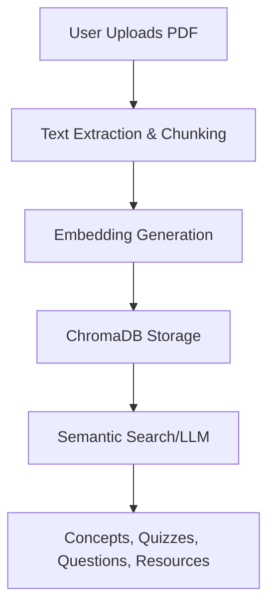
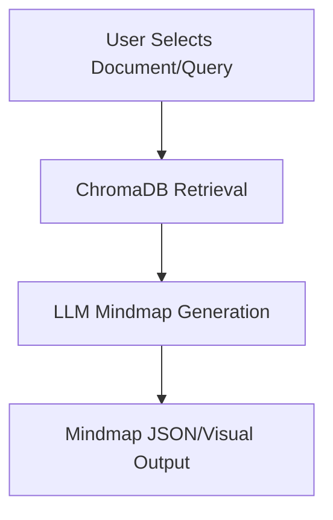
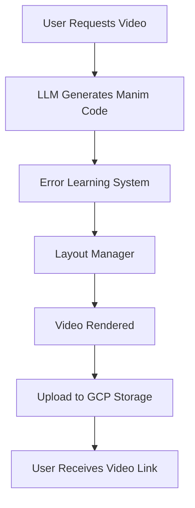
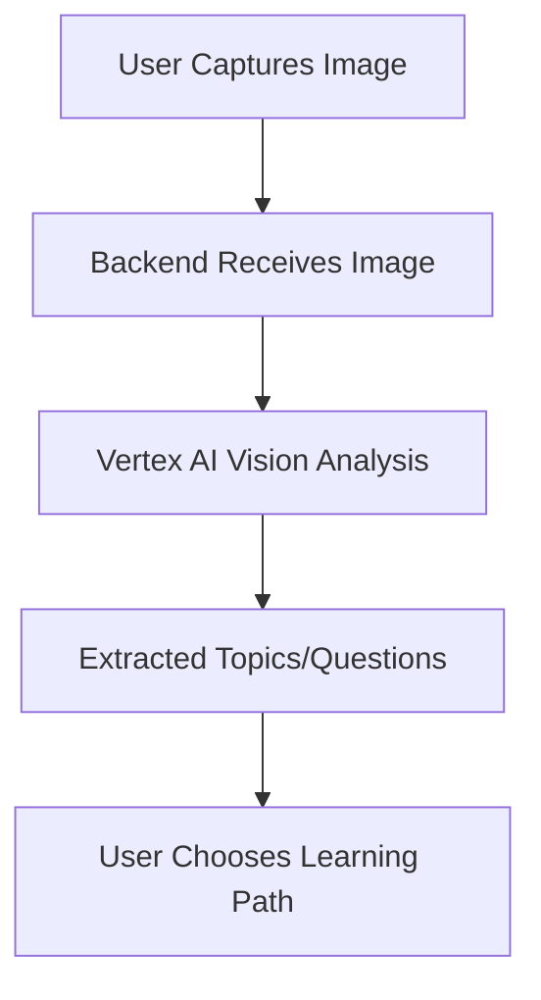
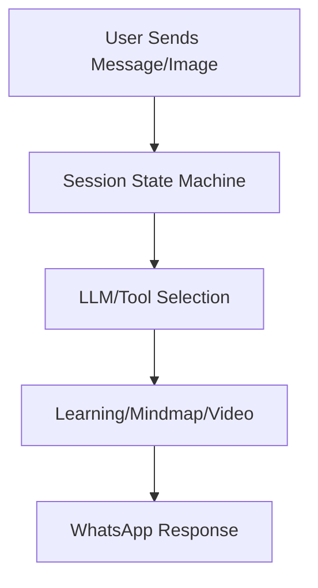

# PragyanAI: Grand Unified AI Learning Platform

---

## Table of Contents
- [Project Overview](#project-overview)
- [System Architecture](#system-architecture)
- [Component Overview](#component-overview)
- [Data & Knowledge Flow](#data--knowledge-flow)
- [Pipeline & Process Flows](#pipeline--process-flows)
- [Key Use Cases](#key-use-cases)
- [GCP & Vertex AI Integration](#gcp--vertex-ai-integration)
- [Sarvam AI Integration](#sarvam-ai-integration)
- [Security & Scalability](#security--scalability)
- [Extensibility & Customization](#extensibility--customization)
- [Appendix: Visual Diagrams](#appendix-visual-diagrams)

---

## Project Overview

**PragyanAI** is a next-generation, modular, cloud-native AI learning platform that unifies document understanding, mindmap generation, video creation, AR-based educational content extraction, and conversational learning—all powered by state-of-the-art LLMs, Google Vertex AI, and Sarvam AI. The system is designed for extensibility, multi-modal input, and seamless integration with WhatsApp, web, and AR interfaces.

---

## System Architecture

### High-Level Architecture Diagram

```
+-------------------+      +-------------------+      +-------------------+
|   User Devices    |<---->|   API Gateway     |<---->|   Backend Core    |
| (Web, AR, WhatsApp|      | (Flask/FastAPI)   |      | (Python Modules)  |
+-------------------+      +-------------------+      +-------------------+
         |                          |                          |
         v                          v                          v
+-------------------+      +-------------------+      +-------------------+
|  GCP Vertex AI    |<---->|  ChromaDB Vector  |<---->|  External LLMs    |
|  (LLMs, Vision)   |      |  Store (Remote)   |      |  (Sarvam, Groq)   |
+-------------------+      +-------------------+      +-------------------+
```

- **User Devices**: Web browsers, AR camera, WhatsApp clients
- **API Gateway**: Flask/FastAPI endpoints for REST, WebSocket, and webhook communication
- **Backend Core**: Modular Python services for learning, mindmaps, video, translation, TTS, etc.
- **GCP Vertex AI**: Used for LLMs, image analysis, and video generation
- **ChromaDB**: Centralized vector store for user documents and embeddings
- **External LLMs**: Sarvam AI, Groq, and others for advanced language tasks

---

## Component Overview

### 1. **Learning Agent**
- **Purpose**: Ingests user documents (PDFs), enables semantic search, concept breakdown, question/quiz generation, and resource curation.
- **Tech**: FastAPI, ChromaDB (local/remote), Sentence Transformers, Vertex AI, Groq LLMs
- **Endpoints**: `/ingest_pdf`, `/concept_explorer`, `/question_agent`, `/quiz_agent`, `/resource_curator`, etc.
- **Flow**: User uploads PDF → Text chunked & embedded → Stored in ChromaDB → Queried for learning tasks

### 2. **MindMap Generation**
- **Purpose**: Generates interactive mindmaps from user documents or queries, visualizing knowledge structure.
- **Tech**: FastAPI, EnhancedMindmapGenerator, ChromaDB, Groq LLMs
- **Endpoints**: `/generate-mindmap/`, `/user-documents/`, `/generate-mindmap-from-document/`
- **Flow**: User selects document/query → Mindmap generated via LLMs → JSON/visual output

### 3. **Video Generation**
- **Purpose**: Creates educational videos (with narration, animation) from topics or document content.
- **Tech**: Vertex AI, Manim, Google Cloud Storage, Error Learning System, Layout Manager
- **Flow**: User requests video → LLM generates Manim code → Code validated, errors fixed via RL → Video rendered & uploaded to GCP

### 4. **AR Camera & Image Analysis**
- **Purpose**: Extracts educational content from images using Vertex AI vision models.
- **Tech**: Flask, Vertex AI, PIL, AR web interface
- **Flow**: User captures image → Image sent to backend → Vertex AI analyzes for topics/questions → User receives learning options

### 5. **WhatsApp AI Agent**
- **Purpose**: Conversational interface for learning, mindmaps, and video generation via WhatsApp.
- **Tech**: Flask, Twilio, SocketIO, Vertex AI, ChromaDB
- **Flow**: User sends message/image → Session managed → AI responds with explanations, mindmaps, or videos

### 6. **Translation & TTS Agents**
- **Purpose**: Multilingual support and text-to-speech for accessibility.
- **Tech**: Custom Python modules, external APIs

---

## Data & Knowledge Flow

### Data Pipeline Diagram

```
[User PDF/Image/Query]
      |
      v
[API Gateway (Flask/FastAPI)]
      |
      v
[Preprocessing & Embedding]
      |
      v
[ChromaDB Vector Store]
      |
      v
[LLM/Vertex AI/Sarvam AI]
      |
      v
[Learning/Quiz/Mindmap/Video Generation]
      |
      v
[User Output (Web/AR/WhatsApp)]
```

- **Document Ingestion**: PDFs are chunked, embedded, and stored per user
- **Query Handling**: User queries are semantically matched to document chunks
- **LLM Orchestration**: LLMs select tools (LearningAgent, Mindmap, Video, etc.) based on user intent
- **Video Pipeline**: Manim code generated, validated, errors fixed, video rendered, uploaded to GCP
- **Image Analysis**: Images analyzed by Vertex AI for educational content extraction

---

## Pipeline & Process Flows

### 1. **Learning Agent Flow**


### 2. **Mindmap Generation Flow**


### 3. **Video Generation Flow**


### 4. **AR Camera Flow**


### 5. **WhatsApp Agent Flow**


---

## Key Use Cases

- **Personalized Learning**: Users upload their own documents, get tailored explanations, quizzes, and mindmaps.
- **Visual Learning**: Mindmaps and videos generated from user content for deeper understanding.
- **Conversational AI**: WhatsApp and web chat for natural, interactive learning.
- **AR-Driven Discovery**: Snap a photo of a textbook/board, instantly get topics, questions, and learning resources.
- **Multilingual & Accessible**: Translation and TTS for diverse learners.

---

## GCP & Vertex AI Integration

- **Vertex AI LLMs**: Used for advanced language tasks, code generation, and image analysis (Gemini 2.5 Pro, etc.)
- **Vertex AI Vision**: Powers image-to-topic/question extraction in AR and WhatsApp flows.
- **Google Cloud Storage**: Stores generated videos, code, and learning artifacts for scalable access.
- **ChromaDB on GCP**: Remote vector store for scalable, multi-user document management.
- **Service Accounts & Security**: Uses GCP credentials for secure API access and storage.

---

## Sarvam AI Integration

- **SarvamAILLM**: Custom LLM wrapper for Sarvam AI, used for chat, explanations, and fallback tasks.
- **Plug-and-Play**: Easily switch between Sarvam, Groq, and Vertex AI for different LLM needs.
- **API Key Management**: Securely loads Sarvam AI keys from environment.

---

## Security & Scalability

- **User Isolation**: Each user's documents and embeddings are stored in separate ChromaDB collections.
- **Cloud-Native**: Designed for GCP deployment, with Docker support and SSL for secure endpoints.
- **Session Management**: WhatsApp and web sessions tracked for personalized, stateful interactions.
- **Extensible Microservices**: Each agent (Learning, Mindmap, Video, etc.) is modular and can be scaled independently.

---

## Extensibility & Customization

- **Add New Agents**: Easily add new AI agents (e.g., summarization, Q&A, etc.)
- **Custom LLMs**: Swap in new LLMs or APIs as needed (Groq, Sarvam, Vertex, etc.)
- **Frontend Agnostic**: Works with web, AR, mobile, and chat interfaces.
- **Pluggable Storage**: ChromaDB can be local or remote (GCP), supporting both dev and prod.

---

> **PragyanAI** is a grand, extensible, and future-proof platform for AI-driven education, designed for the next generation of learners and educators. For more details, see the codebase and individual module documentation.
